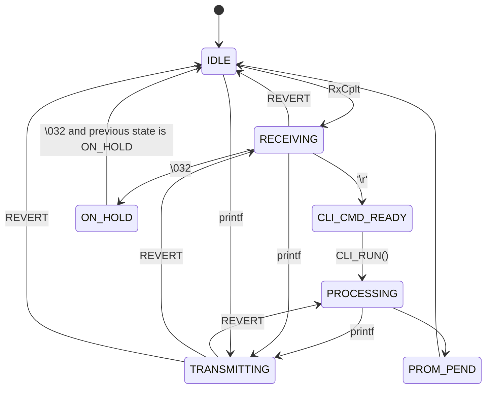

# bShell: A simple CLI for STM32

## TODO

1. Add timeout and error handling states.
2. Do something about `_write`.

## Description

This is a relatively small CLI library for STM32 UART, somewhat inspired by [uShell](https://github.com/mdiepart/ushell-stm32/tree/master), but (at least in my opinion) a little better written, although it might not be true. It reads and writes data entirely in interrupt mode, although commands themselves are processed in the main loop.

## Disclaimer

This library is untested, likely buggy and inefficient, so DO NOT use it in any critical applications, where human lives, health or property might be at stake.

## How to use it

### Initialization and basic usage

For this library to work, at least one UART interface must be initialized and it's interrupts must be enabled. It's interrupt also must call `HAL_UART_IRQHandler(&huart)` function, because UART IO is working through callback functions. It is also necessary for HAL libraries to be included.

To initialize bShell, you need to call `CLI_Init(CLI_Context_t *ctx, UART_HandleTypeDef *huart)`. `CLI_Context_t` object contains internal information and should not be modified from the outside to avoid state machine corruption. To use the CLI, call `CLI_RUN(CLI_Context_t *ctx, void loop(void))` in the main loop. It is possible to run some code in `loop` function and pause/resume it with `Ctrl+Z`. If you don't need it, just use `LOOP_STUB()`.

### Preferences

To set global library preferences, `cli_const.h` file is used. All preferences are set as macro-definitions.

#### Ring buffer and UART interaction

This library uses ring buffer to enable usage of interrupt mode. It's size can be set in `MAX_BUFFER_LEN` macro. Transmission is done (if necessary) in chunks of size `CHUNK_SIZE`.

It is possible to enable buffer overflow handling, practically using somewhat-polling mode for large texts. Usually it is necessary, since buffer size is not too large. It is done by defining `CLI_OVERFLOW_PENDING`. It is possible to set timeout to this blocking section by defining `CLI_OVFL_PEND_TIMEOUT` (in SysTick ticks). If set to `CLI_OVFL_TIMEOUT_MAX`, will wait indefinetly.

#### Commands' settings

It is possible to set maximum line length (`MAX_LINE_LEN`), maximum number of commands (`MAX_COMMANDS`), maximum number of arguments (`MAX_ARGUMENTS`). It is also possible to display greeting, when the device just started (`CLI_DISPLAY_GREETING`).

### Printing and logging

To print data, it is possible to use either `printf`, `CLI_Print(CLI_Context_t *ctx, char *message)` or `CLI_Println(CLI_Context_t *ctx, char *message)`. They differ only in the form of output. It is also possible to log something by calling `CLI_Log(char *context, char *message)`. It might be useful for example to use this construction:

    CLI_Log(ctx, __func__, "Something happened here");

### Adding custom commands

By default, there are couple of commands available, mostly for the purposes of debugging. To list all commands, use command `help`. To set this prompt, use in `cli_const.h`:

    #define CLI_PROMPT <Your prompt>
    ...
Or it will be set to default "> ". Similarly, it is possible to set custom greeting, to display greeting, use `#define CLI_DISPLAY_GREETING`.

To add custom commands, call:

    CLI_Status_t CLI_AddCommand(CLI_Context_t *ctx, char cmd[], CLI_Status_t (*func)(int argc, char *argv[]));

where `char cmd[]` is command's name and `func` is the handler. The handler takes two arguments: `int argc` (number of symbolic arguments) and `char *argv[]` (arguments themselves), kind of like `main` function in desktop C. Internal logic of commands, including argument processing, is entirely up to you.

> Warning! Checking if number of arguments is consistent with your logic is up to you also, so that it's possible to implement commands with variable number of arguments in the user side.  

### Error handling

CLI functions return error codes. They are values of type `CLI_Status_t`, in case if there was no error, functions return `CLI_OK`. All errors are returned to the top of the stack. User commands should return error codes as well. As of currently, these are error codes available:

1. `CLI_OK` - No error;
2. `CLI_ERROR_ARG` - Error in user command, improper number or type of arguments;
3. `CLI_ERROR_RUNTIME` - Error in user command, something went wrong during runtime;
4. `CLI_ERROR` - General error.

### State machines

To handle pseudo-multithreading, there are two state machines following CLI state. First machine's transition graph is as follows:

The second state machine follows the first one, one step behind. This section is here for the sole purpose of stroking my ego.